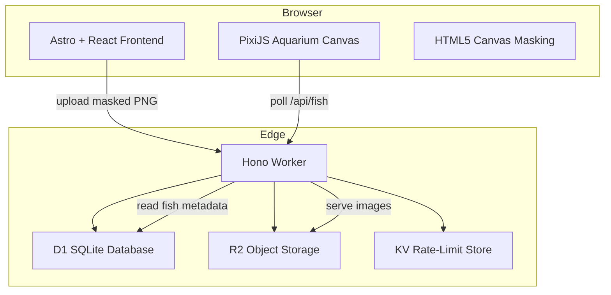
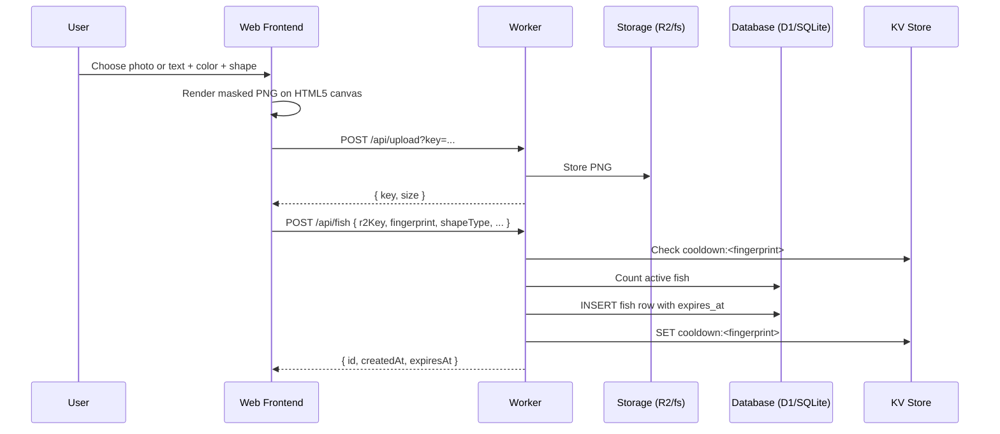
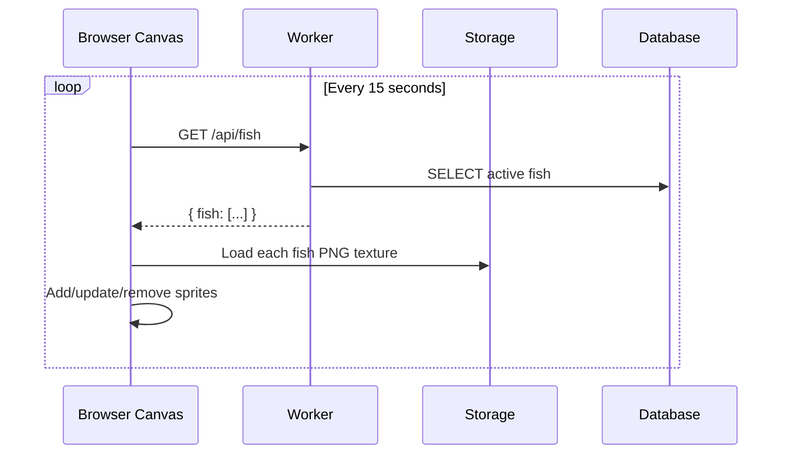

# FishTank — Project Flow, Architecture & System Design

This document describes how the FishTank digital aquarium works end-to-end: the user flow, the monorepo architecture, the data model, the algorithms used, and the deployment targets.

---

## 1. High-Level Overview

FishTank is a shared, time-boxed digital aquarium.

- A visitor can release **one fish every 4 hours**.
- A fish can be created from an **uploaded photo** or a **typed label + color**.
- Each fish is clipped to one of eight silhouette shapes.
- Fish live for **5 minutes** and then disappear automatically.
- The tank holds a maximum of **100 active fish** at once.
- The UI follows a **brutalist** design language: high contrast, monospace type, thick borders, no soft shadows.

---

## 2. System Architecture



For **local development** the same Hono app runs under Node.js with:

- `node:sqlite` instead of D1
- local filesystem instead of R2
- an in-memory `Map` instead of KV

---

## 3. Repository Layout

```
C:/MYProjects/SHowCase/Aquarium
├── apps/
│   ├── web/              # Astro frontend (React islands, PixiJS)
│   └── worker/           # Hono backend (Cloudflare Worker + local Node fallback)
├── packages/
│   └── shared/           # Types, constants, SVG masks
├── docs/                 # This document and deployment guides
├── CHANGELOG-AUDIT.md    # Project audit log
└── package.json          # Turborepo root
```

### 3.1 `apps/web`

| Layer | Tech | Purpose |
|---|---|---|
| Framework | Astro | Static page shells, partial hydration |
| Islands | React | Interactive components (`UploadPipeline`, `AquariumCanvas`) |
| Styling | Tailwind CSS + custom `brutal.css` | Brutalist design tokens |
| Canvas | PixiJS v8 | Fish sprites, bubbles, animation loop |
| Identity | FingerprintJS Pro (optional) | Stable visitor fingerprint for rate limiting |

### 3.2 `apps/worker`

| Layer | Tech | Purpose |
|---|---|---|
| Router | Hono | Type-safe HTTP routes |
| Platform | Cloudflare Workers | Edge runtime with D1, R2, KV |
| Local fallback | Node.js + `@hono/node-server` | Dev mode without Wrangler |
| DB | D1 (SQLite) / `node:sqlite` | Fish metadata and indexes |
| Storage | R2 / filesystem | Masked fish PNG sprites |
| Rate store | KV / in-memory map | Cooldown tracking |

### 3.3 `packages/shared`

Shared TypeScript source of truth for:

- `Fish` type definition
- Constants: `MAX_FISH`, `FISH_LIFESPAN_MS`, `FISH_COOLDOWN_MS`, etc.
- Eight SVG fish masks: `classic`, `puffer`, `shark`, `ray`, `angelfish`, `blob`, `long`, `round`

---

## 4. Data Flow

### 4.1 Releasing a Fish



### 4.2 Viewing the Aquarium



---

## 5. Database Schema

```sql
CREATE TABLE IF NOT EXISTS fish (
  id TEXT PRIMARY KEY,
  r2_key TEXT NOT NULL,
  fingerprint TEXT NOT NULL,
  created_at INTEGER NOT NULL,
  expires_at INTEGER NOT NULL,
  x REAL DEFAULT 0.5,
  y REAL DEFAULT 0.5,
  rotation REAL DEFAULT 0,
  shape_type TEXT NOT NULL,
  text_label TEXT,
  text_color TEXT
);

CREATE INDEX idx_fish_expires ON fish(expires_at);
CREATE INDEX idx_fish_fingerprint ON fish(fingerprint);
CREATE INDEX idx_fish_created ON fish(created_at);
```

- `id` — UUID for the fish.
- `r2_key` — storage key for the masked PNG.
- `fingerprint` — visitor fingerprint for rate limiting.
- `expires_at` — Unix epoch milliseconds; used for filtering and cleanup.
- `x`, `y`, `rotation` — initial placement (currently 0.5, 0.5, 0).
- `text_label`, `text_color` — optional metadata for text-based fish.

---

## 6. Algorithms & Methods

### 6.1 Canvas Masking

The fish sprite is generated entirely in the browser using the HTML5 Canvas API.

```text
1. Create a square canvas (512×512).
2. Draw the source:
   - Photo mode: scale and center the uploaded image.
   - Text mode: fill the canvas with the chosen color, then draw the uppercase text centered.
3. Load the selected SVG silhouette mask as an image.
4. Set ctx.globalCompositeOperation = 'destination-in'.
5. Draw the mask over the source.
6. Export canvas.toDataURL('image/png').
```

`destination-in` keeps source pixels only where the mask is non-transparent, producing a clean silhouette.

### 6.2 Rate Limiting

A simple TTL key-value check:

```text
Key:   cooldown:<fingerprint>
Value: created_at timestamp of the last fish
TTL:   4 hours
```

Before a new fish is inserted:

1. Read `cooldown:<fingerprint>`.
2. If it exists, return `429` with the remaining seconds.
3. Otherwise, insert the fish and write the cooldown key.

### 6.3 Fish Movement

Each fish sprite has:

- `vx`, `vy` — constant velocity vector.
- `wobble` — random phase offset.

On every PixiJS tick:

```text
x += vx
y += vy + sin(now / 1000 * 2 + wobble) * 0.3
rotation = atan2(vy, vx) * 0.2
scale.x = vx > 0 ? positive : negative   # face direction of travel
if sprite leaves any edge, wrap to the opposite edge
```

Bubbles are simple white circles rising upward; when a bubble leaves the top it respawns at the bottom.

### 6.4 Expiry & Cleanup

- **Server-side reads:** `GET /api/fish` only returns rows where `expires_at > now()`.
- **Client-side expiry:** the canvas loop removes sprites whose `expiresAt` has passed.
- **Cleanup route:** `DELETE /api/fish/expired` removes stale rows and can be called by a cron trigger.

### 6.5 Capacity Guard

Before inserting a fish the worker counts active rows. If the count is already `MAX_FISH` (100), it returns `503 Aquarium is full`.

---

## 7. Security & Performance Notes

- **CORS** is enabled for all origins on the Worker.
- **Upload size** is limited to 5 MB on the client.
- **Image MIME type** is validated client-side before masking.
- **Storage keys** include the visitor fingerprint and a UUID to avoid collisions.
- **Cache-Control** is set to 5 minutes (`max-age=300`) for served fish images.
- **Reduced motion** is respected via a CSS media query.

---

## 8. Deployment Targets

### 8.1 Local (no Wrangler)

See `docs/LOCAL.md`.

```bash
pnpm --filter worker run dev:local
pnpm --filter web dev -- --host
```

### 8.2 Cloudflare (production)

See `docs/DEPLOYMENT.md`.

```bash
pnpm --filter worker run deploy
pnpm --filter web build
pnpm exec wrangler pages deploy apps/web/dist --project-name fishtank
```

---

## 9. Summary

FishTank is a small but complete full-stack demo: a brutalist React/Astro frontend, a PixiJS-rendered aquarium, and a Hono backend that can run either on Cloudflare's edge or locally on Node.js. The architecture keeps state minimal (D1/SQLite + object storage + KV), relies on the browser for image generation, and uses simple TTL-based rate limiting and client-side animation to keep the experience lightweight.
